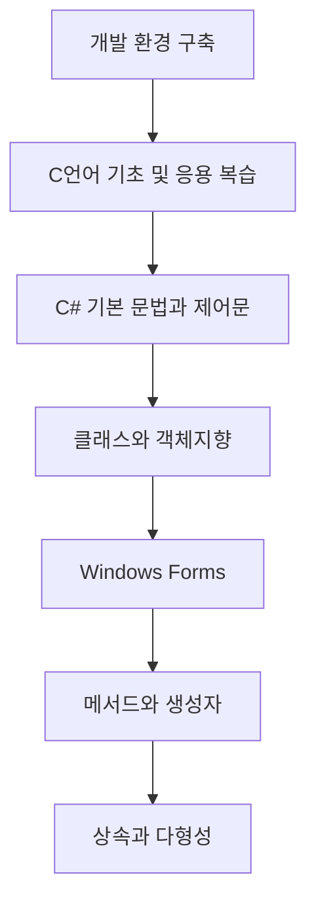

# C# 프로그래밍

원광대학교 게임콘텐츠학전공의 **2026학년도 2학기 C# 프로그래밍** 강의 자료와 실습 예제를 관리하는 저장소입니다.

이 수업은 C언어의 기초를 바탕으로 C# 문법과 객체지향 프로그래밍을 학습하고, .NET 및 Windows Forms를 활용하여 실제 Windows 응용 프로그램을 구현하는 것을 목표로 합니다.

## 목차

- [교과목 개요](#교과목-개요)
- [수업 목표](#수업-목표)
- [학습 성과](#학습-성과)
- [개발 환경](#개발-환경)
- [수업 진행 흐름](#수업-진행-흐름)
- [주차별 수업 계획](#주차별-수업-계획)
- [평가 방법](#평가-방법)
- [저장소 활용 방법](#저장소-활용-방법)
- [과제 및 실습 유의사항](#과제-및-실습-유의사항)
- [교재 및 참고도서](#교재-및-참고도서)

## 교과목 개요

| 구분 | 내용 |
| --- | --- |
| 교과목명 | C# 프로그래밍 |
| 학수번호 | M11002-01 |
| 개설 학기 | 2026학년도 2학기 |
| 이수 구분 | 기초 |
| 학점 및 시수 | 3학점, 이론 2시간 + 실습 2시간 |
| 수강 대상 | 공과대학 공학3계열 및 게임전공 희망 학생 |
| 선수 학습 | C언어 프로그래밍 |
| 수업 방식 | 대면 수업, 이론 강의와 실습 병행 |
| 담당교수 | 이용환 |
| 소속 | 원광대학교 공과대학 공학3계열 게임콘텐츠학전공 |

## 수업 목표

이 교과목을 이수한 학생은 다음 역량을 갖추는 것을 목표로 합니다.

1. C#의 기본 데이터형, 연산자, 조건문, 반복문 및 배열을 이해하고 활용할 수 있습니다.
2. 클래스와 객체를 중심으로 프로그램을 설계하고 구현할 수 있습니다.
3. 추상화, 캡슐화, 상속, 다형성 등 객체지향 프로그래밍의 핵심 원리를 설명하고 코드로 구현할 수 있습니다.
4. 메서드, 생성자, 속성, 오버로딩, 접근 제한자 등 C#의 주요 기능을 활용할 수 있습니다.
5. .NET과 Visual Studio 개발 환경을 이해하고 사용할 수 있습니다.
6. Windows Forms를 활용하여 기본적인 Windows 응용 프로그램을 제작할 수 있습니다.

## 학습 성과

| 학습 성과 | 중요도 | 교과목 학습 성과 내용 |
| --- | :---: | --- |
| 기초지식 | 상 | 객체지향 프로그래밍의 기초지식을 이해할 수 있다. |
| 문제해결 | 중 | 주어진 설계를 바탕으로 클래스를 정의할 수 있다. |
| 실무능력 | 중 | 객체를 중심으로 프로그램을 작성할 수 있다. |

## 개발 환경

### 필수 환경

- Windows 10 또는 Windows 11
- Visual Studio
- C# 및 .NET 개발 환경
- Visual Studio의 **.NET 데스크톱 개발** 워크로드
- Windows Forms 프로젝트를 실행할 수 있는 환경

Visual Studio와 .NET의 세부 버전은 수업 시간에 안내된 기준을 따릅니다.

### Visual Studio 설치 확인

1. Visual Studio Installer를 실행합니다.
2. 사용 중인 Visual Studio에서 `수정`을 선택합니다.
3. **.NET 데스크톱 개발** 워크로드를 선택합니다.
4. 설치가 끝나면 Visual Studio를 실행합니다.
5. 새 C# 콘솔 프로젝트와 Windows Forms 프로젝트를 각각 생성하여 정상 실행되는지 확인합니다.

## 수업 진행 흐름



## 주차별 수업 계획

| 주차 | 학습 주제 | 주요 학습 내용 | 실습 및 평가 |
| :---: | --- | --- | --- |
| 1주차 | 강의 오리엔테이션 및 실행 환경 구축 | 수업 운영 안내, 기존 언어와 객체지향 언어의 차이, Visual Studio 사용법, 프로그램 작성 및 실행, 실습실 안전교육 | C언어 진단 퀴즈, Visual Studio 설치 |
| 2주차 | 선수교과목 재학습 1 | C언어 기초지식 복습 | 기초 연습문제 |
| 3주차 | 선수교과목 재학습 2 | C언어 응용 프로그래밍 복습 | 응용 연습문제 |
| 4주차 | C# 프로그래밍 기초 1 | 프로그램의 기본 구조와 실행 | 실습 프로그램 구현 및 연습문제 |
| 5주차 | C# 프로그래밍 기초 2 | `if` 조건문과 `switch` 조건문 | 실습 프로그램 구현 및 연습문제 |
| 6주차 | C# 프로그래밍 기초 3 | 배열, `while` 반복문, `for` 반복문 | 실습 프로그램 구현 및 연습문제 |
| 7주차 | C# 프로그래밍 기초 4 | 제어문 종합 | 종합 실습 및 연습문제 |
| 8주차 | 중간고사 | 전반부 강의 내용 평가 | 중간고사 |
| 9주차 | 클래스와 객체지향 | 클래스 생성, 인스턴스 변수와 클래스 변수 | 클래스 설계 및 구현 실습 |
| 10주차 | 클래스 기본 | 추상화와 클래스 응용 | 클래스 응용 실습 |
| 11주차 | Windows Forms 기본 | Windows Forms 프로젝트 생성과 기본 구성요소 | GUI 프로그램 구현 실습 |
| 12주차 | 메서드의 기본 1 | 매개변수와 반환값, 클래스 메서드, 오버로딩, 접근 제한자 | 메서드 구현 실습 |
| 13주차 | 메서드의 기본 2 | 생성자와 소멸자, 속성, 값 복사와 참조 복사, Windows Forms에서의 메서드 활용 | 응용 프로그램 구현 실습 |
| 14주차 | 상속과 다형성 | 자료형 변환, 상속의 생성자, 하이딩과 오버라이딩, 상속 및 오버라이딩 제한, Windows Forms 활용 | 상속과 다형성 구현 실습 |
| 15주차 | 기말고사 | 후반부 강의 내용의 이해 및 활용 능력 평가 | 필기 및 실기시험 |

> 주차별 세부 내용과 일정은 학사 운영 및 수업 진행 상황에 따라 변경될 수 있습니다.

## 평가 방법

| 평가 항목 | 반영 비율 |
| --- | :---: |
| 중간고사 | 30% |
| 기말고사 | 30% |
| 출석 | 10% |
| 과제 | 10% |
| 퀴즈 | 10% |
| 수업 태도 | 10% |
| **합계** | **100%** |

- 중간고사와 기말고사는 강의 내용에 따라 필기 및 실기 형태로 진행될 수 있습니다.
- 매 장 또는 주요 학습 단원이 끝난 뒤 연습문제와 응용 실습문제가 과제로 제시될 수 있습니다.
- 수업 중 제시된 예제와 연습문제는 안내된 기간 안에 구현하고 제출해야 합니다.
- 출석 미달 시 학칙 및 강의계획서 기준에 따라 과락 처리될 수 있습니다.

## 저장소 활용 방법

### 저장소 내려받기

Git이 설치되어 있다면 다음 명령으로 저장소를 내려받을 수 있습니다.

```bash
git clone <repository-url>
```

또는 GitHub의 `Code` 버튼을 누른 뒤 `Download ZIP`을 선택합니다.

### 예제 실행

1. 해당 주차 폴더의 솔루션 파일(`.sln`) 또는 프로젝트 파일(`.csproj`)을 엽니다.
2. Visual Studio에서 프로젝트가 정상적으로 로드되었는지 확인합니다.
3. 시작 프로젝트를 선택합니다.
4. `Ctrl + F5`로 디버깅 없이 실행하거나 `F5`로 디버깅을 시작합니다.
5. 필요한 경우 코드의 `TODO` 항목을 완성한 뒤 결과를 확인합니다.

### 권장 저장소 구조

```text
.
├── README.md
├── Week01_Orientation/
├── Week02_C_Review_Basics/
├── Week03_C_Review_Applications/
├── Week04_CSharp_Basics/
├── Week05_Conditionals/
├── Week06_Arrays_and_Loops/
├── Week07_Control_Flow/
├── Week09_Classes_and_Objects/
├── Week10_Class_Applications/
├── Week11_Windows_Forms/
├── Week12_Methods/
├── Week13_Constructors_and_Properties/
├── Week14_Inheritance_and_Polymorphism/
├── Assignments/
└── Resources/
```

실제 폴더명과 자료 구성은 수업 진행 및 저장소 업데이트에 따라 달라질 수 있습니다.

## 과제 및 실습 유의사항

- 수업 전에 해당 주차의 자료와 예제 코드를 확인합니다.
- 예제 코드를 그대로 복사하는 데 그치지 말고, 실행 결과를 예측한 뒤 직접 수정해 봅니다.
- 과제는 교수자가 안내한 파일명, 형식 및 제출 기한을 준수합니다.
- 제출 전 모든 프로젝트가 오류 없이 빌드되고 실행되는지 확인합니다.
- 타인의 코드를 무단으로 복사하거나 자신의 결과물인 것처럼 제출하지 않습니다.
- 저장소에 예제 코드가 공개되어 있더라도 평가용 과제의 정답 코드를 공개 저장소에 업로드하지 않습니다.
- 수업 자료와 예제 코드의 재배포 및 상업적 이용은 담당교수의 안내를 따릅니다.

## 교재 및 참고도서

### 주교재

- 윤인성, *쉽게 배우는 C# 프로그래밍(3판): 프로그래밍 기초부터 객체지향 핵심까지*, 한빛아카데미.

### 참고도서

- 박상현, *이것이 C#이다*, 한빛미디어.
- 박상현, *뇌를 자극하는 C# 5.0 프로그래밍*, 한빛미디어.
- 정성태, *시작하세요! C# 6.0 프로그래밍*, 위키북스.
- 김명렬, *C# 언어 프로그래밍 바이블*, 홍릉과학출판사.
- 최영관, *소설 같은 C#*, 자북출판사.

## 문의

수업 내용, 과제 및 평가와 관련된 문의는 수업 시간에 안내된 공식 연락 채널을 이용해 주세요.
